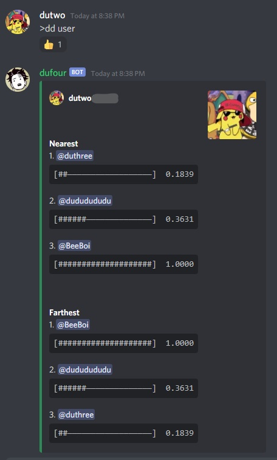
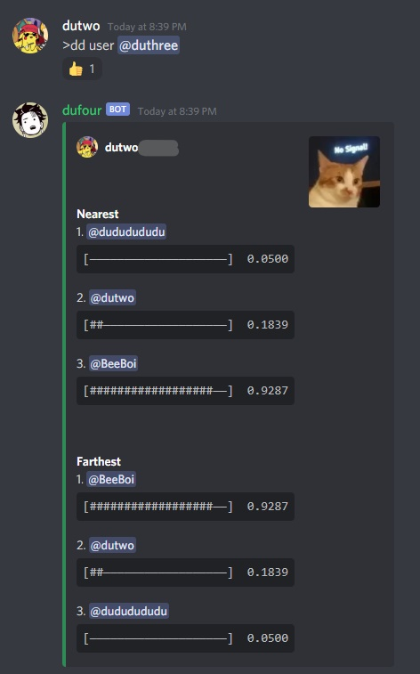
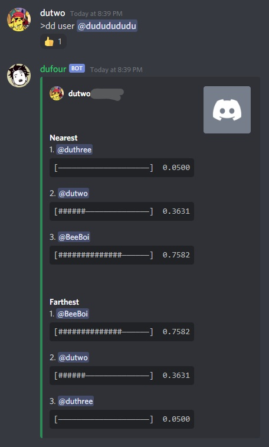
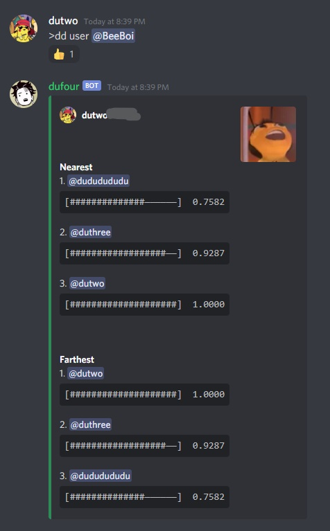
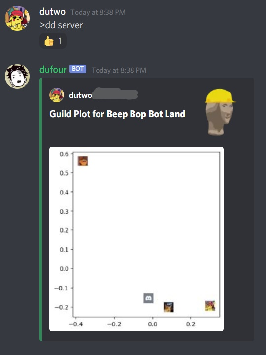
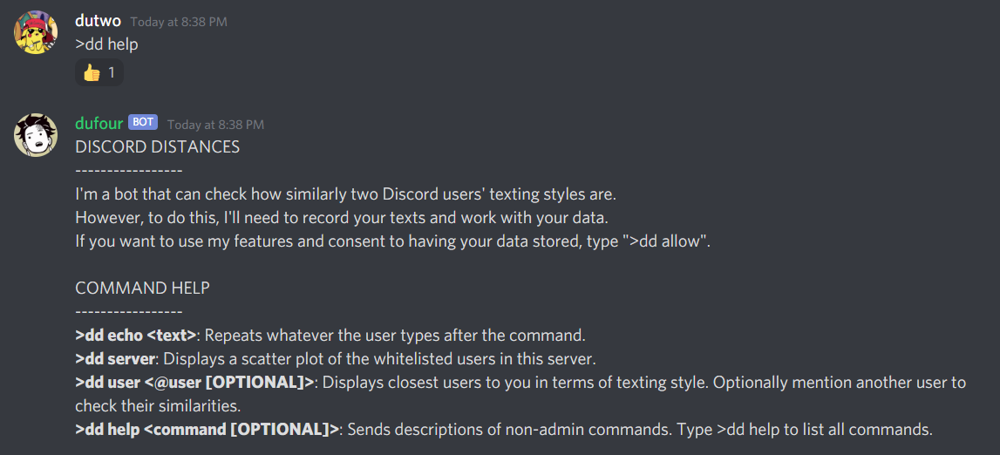

# **Discord Distances**
A Discord bot that computes how similarly Discord users text using NLP and word2vec finetuning.

## **Setup**

This bot was designed to work within a Linux environment. Though, it probably still runs in Windows and Mac.

1. Clone the repo ```git clone https://github.com/tdude92/discord-distances.git```
2. Move into the repo from the terminal ```cd ./discord-distances/```
3. Install NodeJS dependencies ```npm install```
4. Install Python dependencies ```pip3 install -r requirements.txt```
5. Run ```python3 config.py``` and your bot token + other required information.
6. Move into src/ ```cd src/```
7. Start the bot server ```node index.js```
8. Type ```>dd help``` and read the disclaimer.

## **Examples**

Four example users are present in the following demonstrations. *dutwo*, *duthree*, and *dududududu* use Brothers Grimm fairy tales in place of actual message data while *BeeBoi* uses the script of the Bee Movie.

1. Distance between *dutwo* and others



2. Distance between *duthree* and others



3. Distance between *dududududu* and others



4. Distance between *BeeBoi* and others



5. Scatterplot of users in an example guild, **Beep Bop Bot Land**



Notice that *dutwo*, *duthree*, and *dududududu*, who used Brothers Grimm fairy tales for their training data, are grouped together and separated from *BeeBoi*, who used the Bee Movie script for their training data.

## **Features**

1. Dynamically updates the distance in texting style between the users of a Discord guild.
2. Fully automatic! No need to manually update the bot's models. 
3. Offers efficient access to information due to caching mechanisms.

For ethical reasons, only users that type ```>dd accept``` will be visible to the **discord-distances** bot.

## **Commands**



**Some super secret debug commands for dev purposes (for admins only, aka you)**
1. ```>dd errortest```: Throws an error lol. It should get handled by a try-catch.
2. ```>dd lockedecho <text>```: Same as echo but is affected by the lock mechanism (If this command is called while the bot is updating models and distances, execution will be deferred until these computations are complete. The lock is necessary so as to stop the node script and python script from accessing and writing to the same files at the same time).
3. ```>dd testlock <t>```: Activates the locking mechanism for ```t``` seconds.
4. ```>dd update```: Forces the bot to update models and distances. Probably the most useful debug command.
